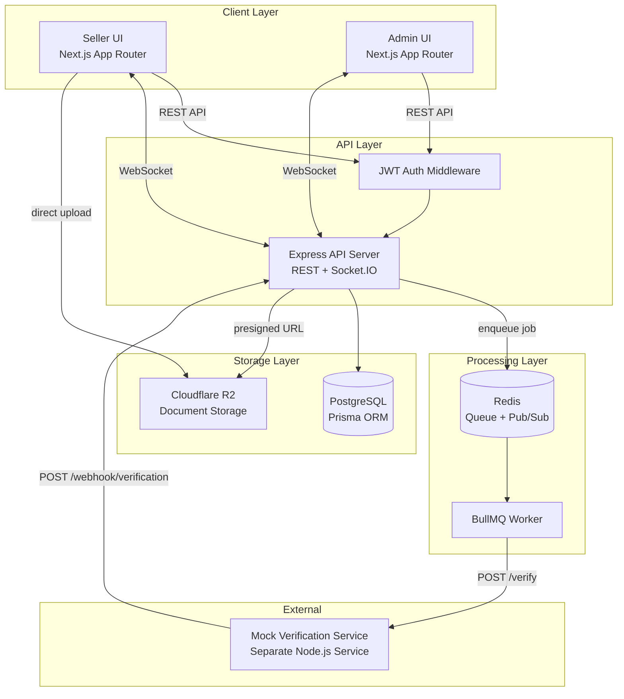
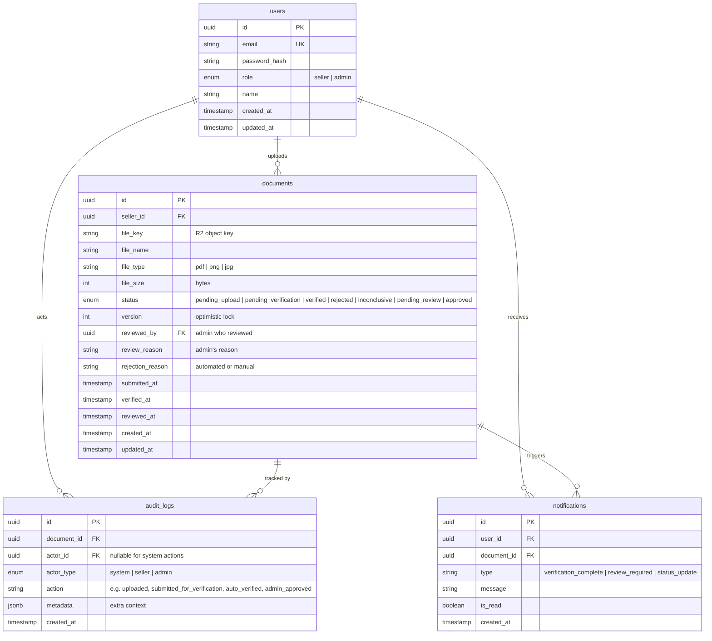
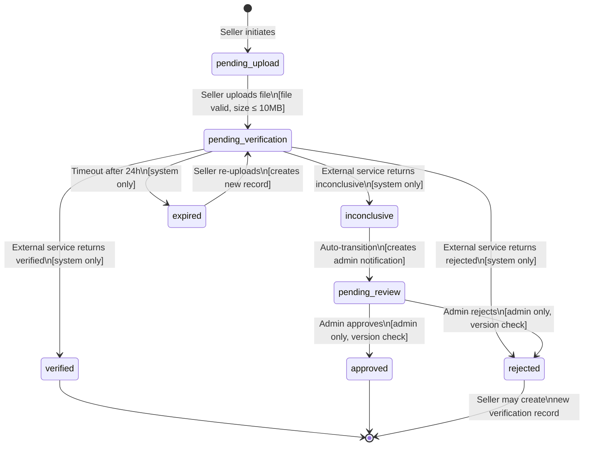

# DESIGN.md — Document Verification Workflow

## 1. Problem Framing

### What is the real problem?

A marketplace platform needs **trust infrastructure for seller onboarding**. Before a seller can list products, the platform must verify their legitimacy — otherwise the marketplace risks fraud, regulatory non-compliance, and erosion of buyer trust. The core challenge isn't "checking a document" — it's building a **reliable, auditable pipeline** that handles the inherent uncertainty of verification (automated results aren't always conclusive) while keeping the seller experience fast and transparent.

### Stakeholders and Success Criteria

| Stakeholder | What they need | Success looks like |
|-------------|---------------|-------------------|
| **Seller** | Fast, transparent onboarding. Know where they stand at all times. | Upload once, get a clear result within hours (not days). Real-time status updates. Clear reason if rejected. |
| **Admin** | Efficient review queue. No duplicate work. Full audit trail. | See only what needs attention (inconclusive cases). Never accidentally overwrite another admin's decision. Complete history for compliance audits. |
| **Platform** | Compliance, fraud prevention, operational visibility. | Every verification decision is traceable. No seller slips through without verification. System handles external service failures gracefully. |

### Out of Scope

- **Document content analysis** (OCR, AI-based validation) — the external service handles this; we only orchestrate
- **Multi-document verification** — one document per seller application for MVP
- **Seller profile/onboarding beyond verification** — no product listing, storefront setup, etc.
- **Admin role hierarchy** — all admins are equal for this feature
- **Internationalization / multi-language support**
- **Payment or subscription gating**

---

## 2. Clarifying Questions

Ordered by impact on design. Top 3 include working assumptions.

### ★ Q1: What is the SLA for verification response time?

**Why it matters:** Determines timeout strategy, retry policy, and whether we need an `expired` state. A 30-second SLA vs. a 48-hour SLA leads to fundamentally different architectures (synchronous wait vs. async queue + webhook).

**Working assumption:** The external service may take up to **24 hours**. If no response after 24h, the verification is marked `expired` and the seller can re-upload. This drives our decision to use BullMQ with delayed jobs for timeout enforcement.

### ★ Q2: Can a seller re-upload after rejection?

**Why it matters:** Changes the data model significantly. If re-upload is allowed, we need to support **multiple verification records per seller** and track which is "current." If not, rejection is terminal for the seller account.

**Working assumption:** Yes, sellers can re-upload. Each upload creates a **new verification record**. The seller's overall status is derived from their latest record. Previous records are retained for audit purposes.

### ★ Q3: How many admins will be reviewing concurrently?

**Why it matters:** Determines concurrency control strategy. 2-3 admins → optimistic locking is fine. 50+ admins → need a proper assignment/queue system with pessimistic locking.

**Working assumption:** Small team, **fewer than 10 admins**. Optimistic locking with real-time presence (via WebSocket) is sufficient. No formal assignment queue needed.

### Q4: What document types and size limits are acceptable?

**Why it matters:** Affects storage strategy, upload validation, and mock service design. Supporting 100MB video files vs. 5MB PDFs is a different engineering problem.

### Q5: What notification channels are required (email, SMS, in-app, push)?

**Why it matters:** Each channel adds integration complexity. Email requires SMTP/transactional email service; SMS requires a provider; push requires service workers.

### Q6: Should admins be able to override an automated `verified` or `rejected` result?

**Why it matters:** If yes, no state is truly terminal until admin confirms. This adds complexity but increases trust in the system. If no, the state machine is simpler.

### Q7: Is there a rate limit on verification submissions per seller?

**Why it matters:** Without rate limiting, a malicious seller could flood the verification service. Need to decide: one pending verification at a time, or allow multiple?

### Q8: What data retention and compliance requirements exist?

**Why it matters:** Determines whether we can soft-delete or must hard-retain all records. Affects audit log design and GDPR considerations.

### Q9: Should the admin review UI show the actual document content, or just metadata?

**Why it matters:** Displaying documents (especially PDFs) in-browser adds frontend complexity. If metadata-only, the admin might need to download separately.

### Q10: What happens to a seller's existing listings if a re-verification fails?

**Why it matters:** If a verified seller re-uploads and gets rejected, do we suspend their listings? This has significant business implications beyond this feature's scope.

---

## 3. Architecture

### 3.1 System Architecture Diagram

### 3.2 Component Breakdown

| Component | Responsibility | Why it exists |
|-----------|---------------|--------------|
| **Next.js Frontend** | Seller + Admin UIs with role-based routing | Single deployable with SSR for SEO/performance; role-based views avoid separate apps |
| **Express API** | Business logic, auth, REST endpoints, WebSocket hub | Separate backend as required by brief; Express for familiarity + ecosystem |
| **JWT Auth Middleware** | Authentication + role-based authorization | Stateless auth for cross-origin FE/BE; role claims (`seller`/`admin`) in token |
| **BullMQ Worker** | Processes verification jobs, handles retries/timeouts | Reliable async processing with retry, delay, backoff; Redis-backed persistence |
| **Redis** | Job queue storage + Socket.IO adapter | BullMQ requires Redis; also serves as Socket.IO pub/sub for horizontal scaling |
| **Mock Verification Service** | Simulates external third-party API | Separate process = clear boundary; webhook callback pattern mirrors real-world integration |
| **PostgreSQL** | Primary data store for users, documents, audit logs | Relational integrity for complex queries (audit trail, status filtering) |
| **Cloudflare R2** | Document file storage | S3-compatible, no egress fees, presigned URLs for secure direct upload |

### 3.3 Data Model

### 3.4 State Machine

**States:**

| State | Description | Who can transition out |
|-------|-------------|----------------------|
| `pending_upload` | Record created, file not yet uploaded | Seller |
| `pending_verification` | File uploaded, waiting for external service | System (BullMQ worker) |
| `verified` | External service confirmed valid | Terminal |
| `rejected` | External service or admin confirmed invalid | Terminal (seller can start new record) |
| `inconclusive` | External service cannot determine | System (auto-transitions to pending_review) |
| `pending_review` | Awaiting admin manual review | Admin |
| `approved` | Admin manually approved | Terminal |
| `expired` | External service didn't respond in 24h | Seller (re-upload) |

**Guards:**
- `pending_upload → pending_verification`: file must be valid (type, size), seller must own the document
- `pending_verification → *`: only the BullMQ worker (system) can set these states
- `pending_review → approved|rejected`: only admin role, optimistic lock version must match
- Re-upload after `rejected` or `expired`: creates a **new** document record, not a state transition on the old one

---

## 4. Stack Decisions

### Backend: Express (TypeScript)

**Why:** Most widely used Node.js framework. Zero learning curve. Excellent middleware ecosystem. Easy to add Socket.IO. The brief explicitly lists backend framework options — Express is the safe, pragmatic choice.

**Rejected:**
- **NestJS** — powerful but opinionated with decorators/DI. Over-engineered for this scope. Longer setup time.
- **Fastify** — faster raw performance, but Express's ecosystem advantage outweighs perf gains at this scale.
- **Hono** — excellent for edge/Cloudflare Workers, but less mature ecosystem for traditional server patterns (Socket.IO, BullMQ).

### Frontend: Next.js (App Router, TypeScript)

**Why:** React-based with SSR, file-based routing, excellent DX. App Router provides server components for better performance. Role-based routing (`/seller/*`, `/admin/*`) is natural with folder structure.

**Rejected:**
- **Vue/Nuxt** — solid alternative but React has larger ecosystem and hiring pool.
- **Plain React SPA** — loses SSR benefits, requires separate routing setup.

### Database: PostgreSQL + Prisma

**Why:** PostgreSQL handles complex queries (audit log filtering, status aggregation) well. Prisma provides type-safe queries, auto-generated migrations, and excellent TypeScript integration.

**Rejected:**
- **MySQL** — less feature-rich (no native JSON operators as powerful as JSONB, no native UUID type).
- **SQLite** — no concurrent write support, unsuitable for multi-user production app.
- **Drizzle ORM** — SQL-like syntax is elegant but Prisma's migration tooling and ecosystem are more mature.
- **TypeORM** — decorator-heavy API feels dated; Prisma's schema-first approach is cleaner.

### Async Processing: BullMQ + Redis

**Why:** BullMQ provides reliable job processing with built-in retry (exponential backoff), delayed jobs (for 24h timeout), job events, and a dashboard (Bull Board). Redis is already needed for Socket.IO adapter, so no additional infrastructure.

**Rejected:**
- **RabbitMQ** — enterprise-grade message broker, but requires a separate service (Erlang-based). Over-engineered for a single job type.
- **pg-boss** — PostgreSQL-based queue (zero extra infra), but lacks BullMQ's retry sophistication and has higher DB load under queue pressure.
- **setTimeout / in-process** — unreliable (lost on crash), no retry, no persistence. Not acceptable for a verification workflow where losing a job means a seller is stuck forever.

### File Storage: Cloudflare R2

**Why:** S3-compatible API, zero egress fees, presigned URLs for secure direct upload from browser. Already available in existing infrastructure.

**Rejected:**
- **Local filesystem** — not production-ready, files lost on redeploy, no CDN.
- **Database BLOB** — bloats DB, slow queries, no streaming support.

### Real-time: Socket.IO

**Why:** Bidirectional WebSocket communication for two use cases: (1) seller receives instant status notifications, (2) admin review presence/locking. Built-in room support, reconnection, and fallback to polling.

**Rejected:**
- **Server-Sent Events (SSE)** — unidirectional only; can't broadcast admin presence.
- **Polling** — higher latency, more server load, worse UX.

---

## 5. Trade-offs and Decisions

### Decision 1: BullMQ with webhook callback vs. polling the external service

**The decision:** The mock verification service receives a request and calls back a webhook endpoint on our API when done.

**Alternatives:**
- **Polling:** Our worker periodically checks the external service for results. Simpler to implement but wasteful and latency-prone.
- **Long polling / SSE from external service:** External service holds connection open. Unrealistic — real verification services don't work this way.

**Why webhook:** Mirrors real-world integrations (Stripe, Twilio all use webhooks). Event-driven, no wasted requests. BullMQ handles the initial dispatch; webhook handles the response. Clean separation.

**What I'd change:** If the external service had no webhook support, I'd implement polling with BullMQ repeatable jobs (check every 30s until response or timeout).

### Decision 2: Optimistic locking + Socket.IO presence vs. pessimistic locking for admin review

**The decision:** When an admin opens a document for review, Socket.IO broadcasts their presence to other admins. The actual write uses optimistic locking (`version` field).

**Alternatives:**
- **Pessimistic locking (DB row lock / claim system):** Admin explicitly "claims" a document, locked for 15 minutes. Other admins can't access it.
- **Last-write-wins:** No locking. Whoever submits last overwrites. Audit log captures both.

**Why this approach:** Optimistic locking handles the rare race condition without blocking anyone. Socket.IO presence provides a friendly UX signal ("Admin X is reviewing this") that prevents most conflicts before they happen — reusing infrastructure already in place for seller notifications.

**What I'd change:** At 50+ concurrent admins, I'd switch to pessimistic locking with a formal assignment queue (round-robin or priority-based).

### Decision 3: Separate audit_logs table vs. event sourcing

**The decision:** Append-only `audit_logs` table with one row per state transition.

**Alternatives:**
- **Event sourcing:** Store all changes as events, rebuild document state from event stream. Powerful but complex.
- **JSON history array on document record:** Simple, but doesn't normalize well, hard to query across documents.

**Why append-only table:** Query-friendly (filter by actor, date range, document), easy to add to any state transition with a simple INSERT. No complex event replay logic. Audit requirements are read-heavy, write-occasional — a normalized table with proper indexes is ideal.

**What I'd change:** If compliance required proving that no audit records were ever modified, I'd add a hash chain (each row includes hash of previous row) or use an immutable ledger.

### Decision 4: Monorepo (pnpm workspaces) vs. separate repos

**The decision:** Single monorepo with `packages/frontend`, `packages/backend`, `packages/mock-service`.

**Alternatives:**
- **Separate repos:** Each service in its own Git repo. Independent CI/CD, independent versioning.
- **Turborepo monorepo:** Adds build caching and task orchestration on top of pnpm workspaces.

**Why pnpm workspaces:** For a take-home project, a single repo is easier to review, clone, and run. Shared TypeScript types between frontend and backend. Turborepo's caching adds complexity without enough benefit at this scale.

**What I'd change:** In a real team environment with 5+ developers, I'd add Turborepo for build caching and consider separate repos if teams owned different services.

### Decision 5: JWT stateless auth vs. server-side sessions

**The decision:** JWT tokens with role claims, stored in httpOnly cookies on the frontend.

**Alternatives:**
- **Server-side sessions (express-session + Redis):** Session ID in cookie, session data in Redis. More control over invalidation.
- **NextAuth.js:** Full auth framework with providers, sessions, callbacks. Powerful but heavy for this scope.

**Why JWT:** Natural for cross-origin architecture (Next.js on different port/domain from Express). Role (`seller`/`admin`) embedded in token — no DB lookup per request. Stateless means no session store to manage. For a take-home with seeded users and no complex auth flows (no OAuth, no MFA), JWT is the pragmatic choice.

**What I'd change:** If we needed instant session invalidation (e.g., admin bans a seller, seller must be logged out immediately), I'd add a token blacklist in Redis or switch to server-side sessions.

---

## 6. Failure Modes

### F1: External verification service returns a malformed response

**Scenario:** Webhook callback contains invalid JSON, missing required fields, or unexpected status value.

**How the design handles it:**
- Webhook endpoint validates response against a strict schema (Zod) before processing
- If validation fails: log the raw response to `audit_logs` with `action: "verification_response_invalid"`, set document status to `inconclusive`, and route to admin review
- Rationale: treating malformed responses as `inconclusive` is safer than retrying (the service may keep returning bad data) and ensures the seller isn't stuck

### F2: External verification service is unreachable for hours

**Scenario:** Network failure, service outage, DNS issues.

**How the design handles it:**
- BullMQ job retries with **exponential backoff**: attempts at 1min, 5min, 15min, 30min, 60min (5 retries total)
- Each retry is logged in `audit_logs` with `action: "verification_retry"` and attempt number
- After all retries exhausted: set status to `expired`, notify seller via Socket.IO with message "Verification service temporarily unavailable. Please re-upload."
- A BullMQ **delayed job** fires at the 24h mark as a hard timeout regardless of retry state
- Admin dashboard shows a "service health" indicator based on recent failure rate

### F3: Seller uploads a 50MB PDF

**Scenario:** File exceeds size limit, potentially causing storage issues or slow processing.

**How the design handles it:**
- **Frontend:** File input `accept` attribute limits to PDF/PNG/JPG. Client-side size check (10MB) with user-friendly error before upload begins
- **Backend:** Express `multer` middleware enforces 10MB limit. Requests exceeding limit receive `413 Payload Too Large` with clear message
- **R2 presigned URL:** Generated with `Content-Length` condition, so even direct uploads to R2 are bounded
- Oversized attempts are logged but not stored

### F4: Two admins review the same document simultaneously

**Scenario:** Admin A and Admin B both open the review UI for the same document. Both make a decision.

**How the design handles it:**
1. **Prevention (UX layer):** When Admin A opens the review page, Socket.IO emits `review:started` with admin name. Admin B sees a banner: "Currently being reviewed by Admin A." Admin B can still proceed (soft lock, not hard block).
2. **Protection (data layer):** Document has a `version` field. Admin A loads version 3. Admin B loads version 3. Admin A submits → `UPDATE documents SET status = 'approved', version = 4 WHERE id = X AND version = 3` → succeeds. Admin B submits → same `WHERE version = 3` → 0 rows affected → API returns `409 Conflict` with message "This document was already reviewed."
3. **Recovery:** Admin B's UI auto-refreshes to show the updated state. Both decisions are logged in `audit_logs` — the failed attempt with `action: "review_conflict"`.

### F5: Notification delivery fails (Socket.IO disconnect)

**Scenario:** Seller is offline when their verification completes. Socket.IO event is lost.

**How the design handles it:**
- All notifications are **persisted to the `notifications` table** before being pushed via Socket.IO
- Socket.IO push is fire-and-forget (best effort for real-time)
- When seller reconnects/logs in, frontend fetches unread notifications from REST API (`GET /api/notifications?is_read=false`)
- This dual approach (persist + push) ensures no notification is ever lost, regardless of connection state

### F6: Redis crashes or becomes unavailable

**Scenario:** Redis goes down, affecting BullMQ and Socket.IO.

**How the design handles it:**
- **BullMQ:** Jobs in Redis are persisted to disk (Redis AOF/RDB). On Redis restart, pending jobs resume automatically. No jobs are lost.
- **Socket.IO:** Falls back to in-memory adapter (single-server mode). Real-time features degrade but don't crash the app.
- **Health check endpoint** (`GET /health`) monitors Redis connectivity. Returns `503` if Redis is down, enabling load balancer to route traffic or alert ops.
- **Circuit breaker** on verification job enqueueing: if Redis is down, API returns `503` to the seller with "Please try again in a few minutes" instead of silently dropping the job.

### F7: Presigned URL expires before upload completes (slow connection)

**Scenario:** Seller gets a presigned URL (valid 15min), but their upload takes 20 minutes due to slow connection.

**How the design handles it:**
- Presigned URLs are generated with a **30-minute expiry** (generous for 10MB max)
- If upload fails, frontend shows a retry button that requests a new presigned URL
- Document record remains in `pending_upload` state until upload confirmation
- A cleanup job (BullMQ scheduled) removes stale `pending_upload` records older than 1 hour

---

## 7. Descoped Items

### D1: Real email notifications (SMTP)

**Why descoped:** Requires SMTP provider setup (SendGrid, SES), domain verification, template system. Out of proportion for a take-home.

**How to add later:** Integrate a transactional email service. Create email templates. Add an `email_notifications` BullMQ queue with its own worker. Update `notifications` table with `channel` field and delivery status tracking.

**Risk of descoping:** Sellers must actively check the app. In production, email is essential for engagement.

### D2: Document content analysis / OCR

**Why descoped:** The external service handles this. Our system is an orchestrator, not an analyzer.

**How to add later:** Before sending to external service, run OCR (Tesseract) to extract text, validate document type matches claimed type (e.g., "business license" actually mentions registration numbers).

**Risk of descoping:** Relying entirely on external service means no fallback if service quality degrades.

### D3: Multi-document support per seller

**Why descoped:** MVP assumes one document per verification attempt. Multiple document types (tax cert, business license, ID) add significant data model complexity.

**How to add later:** Add `document_type` enum. Create a `verification_requests` entity that groups multiple documents. State machine applies to the request (all documents must pass).

**Risk of descoping:** Real-world onboarding almost always requires multiple documents. This will need to be addressed before production.

### D4: Admin role hierarchy and permissions

**Why descoped:** All admins are equal in MVP. Adding roles (junior reviewer, senior reviewer, compliance officer) adds authorization complexity.

**How to add later:** Add `admin_level` to users, define permission matrix (who can approve vs. only flag). Add `required_approval_level` to document types.

**Risk of descoping:** In production, not all admins should have equal authority. A junior admin approving a high-value seller could be a compliance issue.

### D5: Comprehensive test coverage

**Why descoped:** Time constraint. Will include at least one meaningful integration test for the core verification flow.

**How to add later:** Unit tests for state machine transitions, integration tests for API endpoints, E2E tests for critical user journeys (Playwright/Cypress).

**Risk of descoping:** Regression risk on future changes. Core flow test provides baseline confidence.

---

## 8. Implementation Plan

Assuming 2 weeks for full feature. Starred (★) items are in-scope for the take-home (~2 hours for code).

| Phase | Tasks | Effort | Dependencies |
|-------|-------|--------|-------------|
| **1. Project Setup** ★ | Monorepo init, Prisma schema, DB migrations, env config, Docker Compose (PostgreSQL + Redis) | 2h | None |
| **2. Auth** ★ | JWT middleware, login/register endpoints, seed admin + seller users, role-based guards | 2h | Phase 1 |
| **3. File Upload** ★ | R2 presigned URL endpoint, upload confirmation, file validation (type, size) | 2h | Phase 1 |
| **4. Mock Verification Service** ★ | Separate service, receives POST, random delay, webhook callback with random result | 2h | Phase 1 |
| **5. Verification Workflow** ★ | BullMQ job dispatch on upload, webhook handler, state transitions, audit logging | 3h | Phases 3, 4 |
| **6. Seller UI** ★ | Login page, upload form, status dashboard with real-time updates | 3h | Phases 2, 3, 5 |
| **7. Admin UI** ★ | Login page, pending review queue, document review page, audit history view | 3h | Phases 2, 5 |
| **8. Socket.IO Integration** ★ | Real-time notifications (seller), review presence (admin), notification persistence | 2h | Phases 6, 7 |
| **9. Error Handling & Validation** | Comprehensive input validation, error responses, circuit breaker | 2h | Phases 5, 6, 7 |
| **10. Testing** | Unit tests (state machine), integration tests (API), E2E (critical paths) | 3h | Phase 9 |
| **11. Polish & Edge Cases** | Retry UI, loading states, empty states, responsive design | 2h | Phase 10 |
| **12. Deployment** ★ | Coolify setup, Cloudflare DNS, environment variables, health checks | 2h | All |

**Critical path:** 1 → 2 → 3 → 4 → 5 → 6/7 (parallel) → 8 → 12

**For the take-home submission:** Phases 1-8 and 12 are prioritized. Phases 9-11 are stretch goals. The goal is at least two complete end-to-end paths (happy path + inconclusive → admin review) with real-time notifications working.
